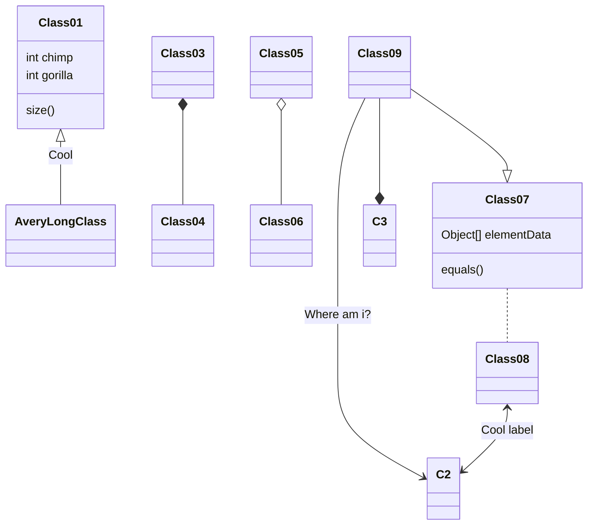

## Overview

Electronic mail (email) is one of the most popular communication media for direct and private communication. Being typically a free service and anonymity-friendly, massive spam email campaigns are common. Nowadays, spam email encompasses scam, phishing, malware distribution, and various other cybersecurity threats. Within these emails, recipients frequently encounter social engineering techniques aimed at persuading them to take an action, such as clicking on a hyperlink, opening an attachment or responding. In this paper, we conduct a study on supervised models to identify persuasion (binary classification) and to identify the specific persuasion techniques that are commonly used in spam email (multilabel classification). To achieve this, we develop systems capable of spotting persuasion in spam emails based on natural language processing techniques. We approach this challenging task at different levels of granularity: full email, sentences and specific text snippets (i.e. text fragments composed by one or more words, typically shorter than a sentence). We replicate and adapt two methodologies used to detect propaganda in news articles. Additionally, we build a custom spam email dataset, and fine-tune pre-trained RoBERTa-based transformer models to tackle the sentence level detection. This allows us to determine how extensively spam emails rely on persuasion to achieve their goals and, if so, to identify those techniques that would be employed for user protection and cybersecurity improvements.

## Go further

- 📚 [**Check the paper**](](https://www.sciencedirect.com/science/article/pii/S0957417424026344))


<!-- Wowchemy is designed to give technical content creators a seamless experience. You can focus on the content and Wowchemy handles the rest.

Use popular tools such as Plotly, Mermaid, and data frames.

## Charts

Wowchemy supports the popular [Plotly](https://plot.ly/) format for interactive data visualizations. With Plotly, you can design almost any kind of visualization you can imagine!

Save your Plotly JSON in your page folder, for example `line-chart.json`, and then add the `` shortcode where you would like the chart to appear.

Demo:



You might also find the [Plotly JSON Editor](http://plotly-json-editor.getforge.io/) useful.

## Diagrams

Wowchemy supports the _Mermaid_ Markdown extension for diagrams.

An example **flowchart**:

    ```mermaid
    graph TD
    A[Hard] - - >|Text| B(Round)
    B - - > C{Decision}
    C - - >|One| D[Result 1]
    C - - >|Two| E[Result 2]
    ```

renders as

```mermaid
graph TD
A[Hard] - ->|Text| B(Round)
B - -> C{Decision}
C -- >|One| D[Result 1]
C - ->|Two| E[Result 2]
```

An example **sequence diagram**:

    ```mermaid
    sequenceDiagram
    Alice->>John: Hello John, how are you?
    loop Healthcheck
        John->>John: Fight against hypochondria
    end
    Note right of John: Rational thoughts!
    John-- >>Alice: Great!
    John- >>Bob: How about you?
    Bob-- >>John: Jolly good!
    ```

renders as

```mermaid
sequenceDiagram
Alice->>John: Hello John, how are you?
loop Healthcheck
    John->>John: Fight against hypochondria
end
Note right of John: Rational thoughts!
John-- >>Alice: Great!
John->>Bob: How about you?
Bob-- >>John: Jolly good!
```

An example **class diagram**:

    ```mermaid
    classDiagram
    Class01 <|-- AveryLongClass : Cool
    Class03 *-- Class04
    Class05 o-- Class06
    Class07 .. Class08
    Class09 -- > C2 : Where am i?
    Class09 --* C3
    Class09 --|> Class07
    Class07 : equals()
    Class07 : Object[] elementData
    Class01 : size()
    Class01 : int chimp
    Class01 : int gorilla
    Class08 <-- > C2: Cool label
    ```

renders as



An example **state diagram**:

    ```mermaid
    stateDiagram
    [*] -- > Still
    Still -- > [*]
    Still -- > Moving
    Moving -- > Still
    Moving -- > Crash
    Crash -- > [*]
    ```

renders as

```mermaid
stateDiagram
[*] -- > Still
Still -- > [*]
Still -- > Moving
Moving -- > Still
Moving -- > Crash
Crash -- > [*]
```

## Data Frames

Save your spreadsheet as a CSV file in your page's folder and then render it by adding the _Table_ shortcode to your page:

```go

```

renders as



## Did you find this page helpful? Consider sharing it 🙌-->
