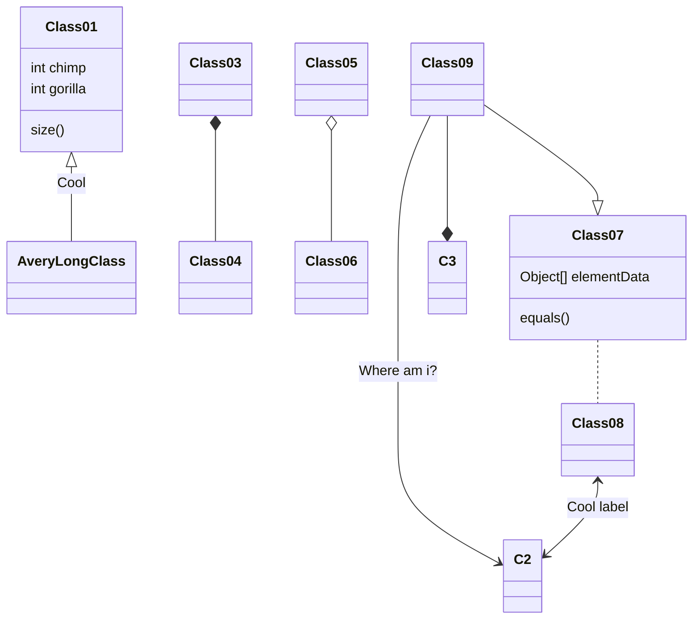

## Overview

Research on knowledge graph construction (KGC) has recently shown great promise also thanks to the adoption of large language models (LLM) for the automatic extraction of structured information from raw text. However, most works rely on commercial, closed-source LLMs, hindering reproducibility and accessibility. We explore KGC with smaller, open-weight LLMs and investigate whether they can be used to improve upon the results obtained by systems leveraging bigger, closed-source models. Specifically, we focus on CodeKGC, a prompting framework based on GPT-3.5. We choose a variety of models either pre-trained primarily on natural language or on code and fine-tune them on three datasets used for information extraction. We fine-tune with prompts formatted either in natural language or as Python-like scripts. In addition, we optionally train the models with prompts including chain-of-thought sections. After fine-tuning, the choice of coding vs natural language prompts has a limited impact on performance, while chain-of-thought training mostly leads to a performance decrease. Moreover, we show that a LLM can be outperformed by much smaller versions on this task, after undergoing the same amount of training. We find that in general the selected lightweight LLMs outperform the much larger CodeKGC by as much as 15–20 absolute F points after fine-tuning. The results show that state-of-the-art KGC systems can be developed using smaller and open-weight models, enhancing research transparency, lowering compute requirements, and decreasing third-party API reliance.

## Go further

- 📚 [**Check the paper**](https://www.sciencedirect.com/science/article/pii/S0306457325001360?via%3Dihub)


<!-- Wowchemy is designed to give technical content creators a seamless experience. You can focus on the content and Wowchemy handles the rest.

Use popular tools such as Plotly, Mermaid, and data frames.

## Charts

Wowchemy supports the popular [Plotly](https://plot.ly/) format for interactive data visualizations. With Plotly, you can design almost any kind of visualization you can imagine!

Save your Plotly JSON in your page folder, for example `line-chart.json`, and then add the `` shortcode where you would like the chart to appear.

Demo:



You might also find the [Plotly JSON Editor](http://plotly-json-editor.getforge.io/) useful.

## Diagrams

Wowchemy supports the _Mermaid_ Markdown extension for diagrams.

An example **flowchart**:

    ```mermaid
    graph TD
    A[Hard] - - >|Text| B(Round)
    B - - > C{Decision}
    C - - >|One| D[Result 1]
    C - - >|Two| E[Result 2]
    ```

renders as

```mermaid
graph TD
A[Hard] - ->|Text| B(Round)
B - -> C{Decision}
C -- >|One| D[Result 1]
C - ->|Two| E[Result 2]
```

An example **sequence diagram**:

    ```mermaid
    sequenceDiagram
    Alice->>John: Hello John, how are you?
    loop Healthcheck
        John->>John: Fight against hypochondria
    end
    Note right of John: Rational thoughts!
    John-- >>Alice: Great!
    John- >>Bob: How about you?
    Bob-- >>John: Jolly good!
    ```

renders as

```mermaid
sequenceDiagram
Alice->>John: Hello John, how are you?
loop Healthcheck
    John->>John: Fight against hypochondria
end
Note right of John: Rational thoughts!
John-- >>Alice: Great!
John->>Bob: How about you?
Bob-- >>John: Jolly good!
```

An example **class diagram**:

    ```mermaid
    classDiagram
    Class01 <|-- AveryLongClass : Cool
    Class03 *-- Class04
    Class05 o-- Class06
    Class07 .. Class08
    Class09 -- > C2 : Where am i?
    Class09 --* C3
    Class09 --|> Class07
    Class07 : equals()
    Class07 : Object[] elementData
    Class01 : size()
    Class01 : int chimp
    Class01 : int gorilla
    Class08 <-- > C2: Cool label
    ```

renders as



An example **state diagram**:

    ```mermaid
    stateDiagram
    [*] -- > Still
    Still -- > [*]
    Still -- > Moving
    Moving -- > Still
    Moving -- > Crash
    Crash -- > [*]
    ```

renders as

```mermaid
stateDiagram
[*] -- > Still
Still -- > [*]
Still -- > Moving
Moving -- > Still
Moving -- > Crash
Crash -- > [*]
```

## Data Frames

Save your spreadsheet as a CSV file in your page's folder and then render it by adding the _Table_ shortcode to your page:

```go

```

renders as



## Did you find this page helpful? Consider sharing it 🙌-->
